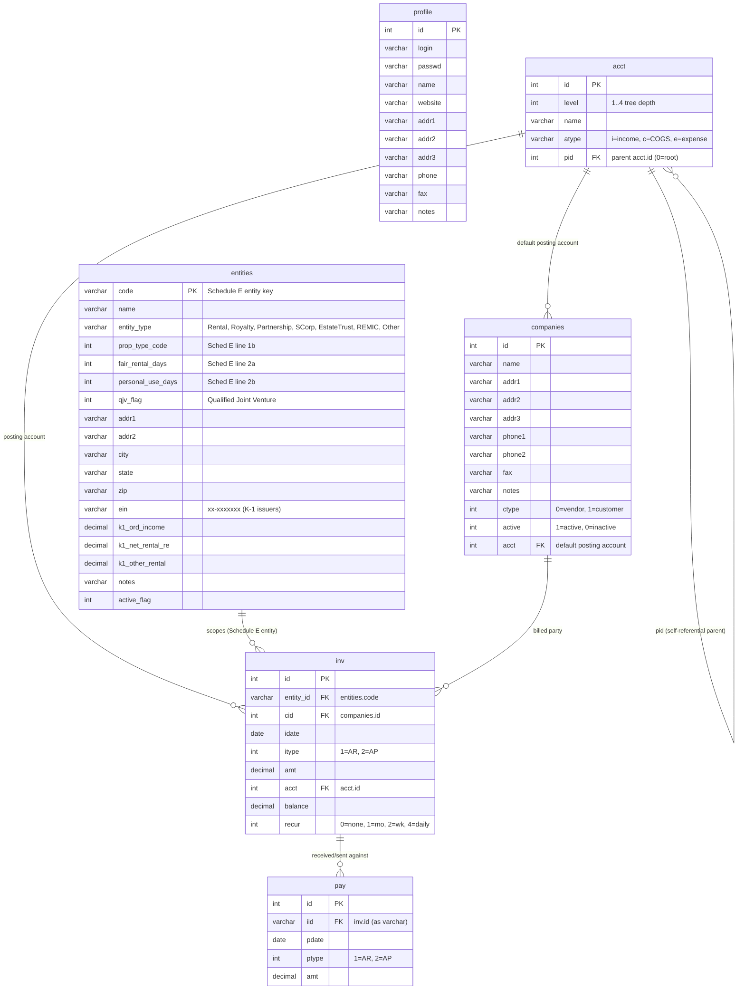

# ShoeboxAI

A single-user PHP + MySQL bookkeeping app. Tracks companies (customers and vendors), accounts (chart of accounts), invoices (A/R and A/P), payments, and reports — scoped per Schedule E entity (rental property, partnership, S-corp, royalty, etc.) for personal tax preparation.

Runs locally under Apache. No build step, no package manager, no test suite — edit a `.php` file and reload.

## Requirements

- Apache HTTPD with `mod_php` (or PHP-FPM)
- PHP 7.x or 8.x with the PDO MySQL extension (`pdo_mysql`); also works against PHP 5.x via the legacy `mysql_*` extension if `$version` is flipped — see [Dual driver](#dual-driver-mysql-vs-pdo)
- MySQL 5.x or 8.x (the code supports both wire protocols)
- On SELinux-enforcing systems (RHEL/CentOS/Rocky/Alma): the bundled `my-httpd.pp` policy module, which permits `httpd_t` to read files from `user_home_t` and write to `httpd_log_t` (the app lives in a user home directory).

## Initial setup

### 1. Database

Create the schema by running the build script as a DB admin user:

```bash
mysql -u dba -p < build/build.sql
```

> **Destructive.** `build/build.sql` drops and recreates the application database. Take a `mysqldump` first if there is existing data you want to keep — see [Backup and restore](#backup-and-restore).

The application connects with the credentials hardcoded in `shoeboxai_db.php`:

```
host:     localhost
user:     dba
database: ShoeboxAI
```

Edit `shoeboxai_db.php` if your local setup differs. The password is also in that file in plaintext (this is a personal-use app served from `localhost`).

### 2. Apache

Drop the repo into a directory Apache can serve and point a `DocumentRoot` (or `Alias`) at it. Entry point is `index.php`. There is no URL rewriting — every form posts back to `index.php` with a button-name field that selects what gets rendered.

### 3. SELinux (optional, only on enforcing systems)

If Apache is denied access to the repo because it lives under a user's home directory, install the bundled policy module:

```bash
semodule -i my-httpd.pp
```

The source policy is in `my-httpd.te` (recompile with `checkmodule` + `semodule_package` if you change it).

### 4. Configure Schedule E entities

The "which book are we looking at" dropdown is populated from `sched.json` at runtime. Edit that file to add, rename, or remove entities:

```json
{
  "general":      "General Income and Expenses",
  "schedA":       "Schedule A Expenses",
  "schedC":       "Schedule C income and expenses",
  "schedE":       "Schedule E income and expenses",
  "Royalty":      "Royalty Income",
  "Partnership1": "Partnership 1",
  ...
}
```

The key is the value stored in the DB; the value is the label shown in the UI. No restart needed — `sched.json` is read on every request by `shoeboxai_env.php`.

## Daily use

1. Open the app in a browser (`http://localhost/...` or wherever it's mounted).
2. Select a Schedule E entity from the dropdown at the top — this scopes every list, form, and report to that entity.
3. Use the top-bar buttons to navigate:
   - **Companies** — customers and vendors
   - **Accts** — chart of accounts (tree of parent/child accounts)
   - **AR Inv** / **AR Income** — accounts receivable: invoices and payments received
   - **AP Inv** / **AP Pay** — accounts payable: bills and payments sent
   - **Reports** — generate previews or print reports (GL, P&L, etc.)

Forms post back to `index.php` with named buttons; the page re-renders showing the result.

## Codebase layout

| Path | Purpose |
|---|---|
| `index.php` | Front controller. Giant `if / elseif` chain on form button names (`v_*` for nav, `f_*` for form actions). |
| `shoeboxai_tools_startup.php` | Bootstrap. Includes the DB, env, and tool modules in order; calls `get_companies()` and `get_accts()` to warm in-memory arrays. |
| `shoeboxai_db.php` | Opens the DB connection (PDO or legacy `mysql_*` depending on `$version`). Credentials hardcoded here. |
| `shoeboxai_env.php` | Declares **all** globals: status/role/app bitmaps, todo type/status enums, form-hint strings, empty arrays the tool modules fill in. Loads `sched.json` into `$schedE_options`. Opens the daily log file (`logs/ShoeboxAIPay_<YYYY-MM-DD>.log`) and the report scratch file (`logs/ShoeboxAIPay_rpt.tmp`). |
| `shoeboxai_tools.php` | Shared helpers: `runsql`, `logger`, `getlastid`, date formatting. |
| `shoeboxai_tools_acct.php` | Chart-of-accounts logic; parent/child tree maintained in `$acct_pid` / `$acct_lvl`. |
| `shoeboxai_tools_comp.php` | Companies (customers + vendors, discriminated by `$ctype_customer` / `$ctype_vendor`). |
| `shoeboxai_tools_inv.php` | Invoices (AR vs AP, discriminated by `$invtype_ar` / `$invtype_ap`). |
| `shoeboxai_tools_rpt.php` | Reports. `rpt_exec(..., 'preview')` writes HTML to screen; `rpt_exec(..., 'exec')` writes to the scratch file and shells out to print. |
| `sched.json` | Schedule E entity list — populates the entity dropdown. |
| `Shoebox.css`, `shoeboxai_fonts.css` | Screen styles. |
| `print.css` | Print-media override. |
| `pf.css` | Styles for the bundled PrintFriendly button injected from `index.php`. |
| `ShoeboxAI.js` | Front-end JS (small). |
| `build/` | `build.sql` (schema), `functions.sql`, plus a library of ad-hoc report queries (`gl_report.sql`, `rent_*_report.sql`, `invoices_<entity>.sql`, `recurring_*.sql`) run by hand against the live DB. |
| `build/tkt/` | Legacy `Admin` / `Portal` / `ToDo` / `Time` / `Doc` / `Logs` schemas. Not touched by the current `index.php`. |
| `backup/` | `mysqldump` outputs (`*.dmp`). Not committed casually — these may contain real data. |
| `cal/` | Vendored third-party PHP-Calendar (GPL). Don't modify unless intentional. See `cal/README`, `cal/INSTALL`. |
| `fonts/`, `gif/` | Static assets. |
| `logs/` | Daily app logs and report scratch file. |
| `ToDo/` | Author's running design notes — maps roughly onto `index.php` route keys; useful as a feature map. |
| `my-httpd.te`, `my-httpd.pp` | SELinux policy source and compiled module. |

## Database schema

Six tables in the `ShoeboxAI` database. Source of truth is `build/build.sql`.



### Notes on the relationships

- **No foreign-key constraints are declared in the DDL.** The relationships above are enforced by the PHP code, not the database. `inv.acct`, `inv.cid`, `companies.acct`, and `pay.iid` are plain `int`/`varchar` columns — orphan rows are possible.
- **`acct` is a self-referential tree.** `pid` points at the parent `acct.id`; roots use `pid = 0`. `level` is the tree depth (1..4) and is maintained by the app, not computed.
- **`pay.iid` is `varchar(8)`** even though `inv.id` is `integer`. The join works because MySQL coerces, but it's a historical quirk — don't model it as a typed FK.
- **`inv.itype` and `pay.ptype` both use `1=AR, 2=AP`** — mirrored in PHP as `$invtype_ar` / `$invtype_ap` in `shoeboxai_env.php`. Keep both sides in sync when adding a type.
- **`companies.ctype`** uses `0=vendor, 1=customer` — mirrored as `$ctype_vendor` / `$ctype_customer`. A company is one or the other, not both.
- **`entities.code` is the scope key** referenced everywhere as `$schedE` / `$entity_id` in PHP. The labels shown in the UI come from `sched.json`, not from `entities.name` — the two can drift.
- **`profile` is a single-row table** describing the app owner. It's not joined to anything; it just feeds the header.

## Patterns for extending the app

### Front controller routing

Every form posts back to `index.php`. The form input **name** is the route key:

- `v_*` — view/nav buttons (`v_apinv`, `v_arinv`, `v_comp`, `v_acct`, `v_rpt`, `v_appay`, `v_arpay`, `v_schedE`, `v_rpt_exec`, …)
- `f_*_add` / `f_*_ins` / `f_*_upd` / `f_*_updsubmit` / `f_*_del` — form action submits
- `f_*` (anything else) — form field values, read via `$_REQUEST['f_*']`

To find an existing handler, grep `index.php` for the route key. For example, the AP-invoice-add handler is wherever `f_inv_add_ap` is matched.

To add a new feature, add a new `elseif (!empty($_REQUEST['x_yourkey']))` branch in `index.php` and a button/form with `name="x_yourkey"` somewhere in the rendered HTML.

### Dual driver (mysql vs PDO)

Every data-access function in `shoeboxai_tools*.php` branches on `$version`:

```php
if ($version == "5.0") {
    $result = mysql_query($sql);
    while ($row = mysql_fetch_array($result)) { ... }
} else {
    foreach ($pdo->query($sql) as $row) { ... }
}
```

When adding a query, follow the same shape. The two branches diverge on cursor APIs, so don't try to factor it out — `runsql()` in `shoeboxai_tools.php` is the only shared helper.

### SQL is built by string concatenation

There is no parameter binding anywhere — even in the PDO branch. Queries look like:

```php
$sql .= "WHERE pid = '".$pid."' AND id = ".$id;
```

Since the app is single-user and runs on localhost, this is acceptable, but **do not** add inputs from untrusted sources without manual escaping.

### Adding a status/role/app bitmap or enum value

Status/role/app bitmaps and todo type/status enums are declared as PHP globals in `shoeboxai_env.php` **and** mirrored on the SQL side in `build/pay/build.sql`. When adding a new bit or enum value, update both files in the same change.

### Adding a Schedule E entity

Edit `sched.json` — add a `"key": "Label"` entry. The dropdown re-populates on the next request. No code changes needed.

## Backup and restore

### Backup

```bash
ts=$(date +%Y%m%d_%H%M%S)
mysqldump -u dba -p --single-transaction --routines --triggers \
  ShoeboxAI > backup/shoeboxai_${ts}.dmp
```

`--single-transaction` gives a consistent InnoDB snapshot without locking the DB.

### Restore from a dump

```bash
mysql -u dba -p ShoeboxAI < backup/shoeboxai_<timestamp>.dmp
```

### Full schema rebuild

```bash
mysql -u dba -p < build/build.sql
```

Destructive — drops and recreates the application database. Always take a backup first.

## Known quirks

- **`shoeboxai_tools_rpt.php_save`** is an intentional backup copy of the reports module. Don't delete it.
- **Vim swap files** (`.*.sw[a-p]`, `.*.swo`, `.*.swc`, etc.) clutter the directory from years of editing. Ignore them; don't commit new ones.
- **The PDO connect string** in `shoeboxai_db.php` contains spaces around the `=` signs (`"mysql:host = $db_host ; dbname = $db_name"`). PDO tolerates this but it's non-idiomatic.
- **`print $version;`** at the top of `shoeboxai_tools_startup.php` echoes the driver version into the page output on every request. Cosmetic, not a bug.
- **No authentication.** The app trusts whoever can reach `index.php`. Keep it bound to localhost.

## License

The bundled PHP-Calendar in `cal/` is GPL — see `cal/COPYING`. The rest of the app is personal-use code with no declared license.
